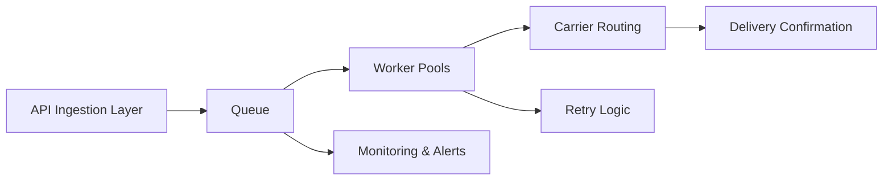

# Hero Case Study  
## Improving Message Delivery Reliability and Reducing End‑to‑End Latency for an Enterprise B2B Messaging Platform

## Summary at a Glance
- **Problem:** Rising latency, delivery failures, and SLA violations  
- **Scale:** Millions of messages/day across enterprise customers  
- **My Role:** Senior Product Manager leading cross-functional initiative  
- **Teams:** Backend, SRE, Data Engineering, Customer Success  
- **Impact:** 38% latency reduction, 52% fewer failures, 120 days incident-free  

This case study demonstrates how I led a cross‑functional initiative to improve message delivery reliability and reduce end‑to‑end latency for a B2B messaging platform used by enterprise customers.

---

## System Overview (High-Level Architecture)

---

**Next Section:**  
➡️ [Discovery & Root Cause](discovery.md)

### 📄 Files
- [`discovery.md`](discovery.md)
- [`strategy.md`](strategy.md)
- [`roadmap.md`](roadmap.md)
- [`prd.md`](prd.md)
- [`execution.md`](execution.md)
- [`outcomes.md`](outcomes.md)
